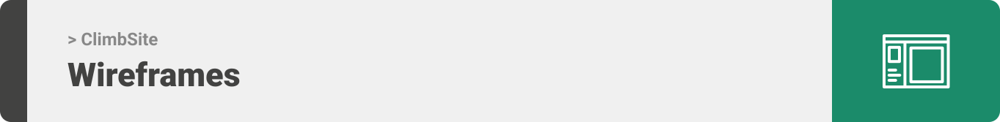

<div align="center">

> Hello world! This is the project’s summary that describes the project plain and simple, limited to the space available. 


**[PROJECT PHILOSOPHY](https://github.com/joeri2k/ClimbSite#-project-philosophy) • [WIREFRAMES](https://github.com/joeri2k/ClimbSite#-wireframes) • [TECH STACK](https://github.com/joeri2k/ClimbSite#-tech-stack) • [IMPLEMENTATION](https://github.com/joeri2k/ClimbSite#-impplementation) • [HOW TO RUN?](https://github.com/joeri2k/ClimbSite#-how-to-run)**

</div>

<br><br>


> it’s an app for climbers in Lebanon, it shows all the climbing and bouldering sites in Lebanon and shows all the routes and info needed for each one of them and climbers can track their progress; the routes they sent how many tries it took them put notes on them share their feedback and rate each one them etc…
> 
> Knowing the situation in Lebanon it’s harder to buy a new climbing gear or doesn’t have a ride, for this reason climbers can post an event or schedule a day when they are going climbing and other people can ask to join and climb with. This way climbers can also connect with each other since it’s a growing community and will be helpful for the climbers unable to go without a ride or gear.


### User Stories
- As a climber, I need a map to explore climbing crags or indoors gym.
- As a climber, I need to know the info of the crag I’ve picked.
- As a climber, I need to track my progress.
- As a climber I need to follow other climbers to check their progress.
- As a climber I need to create a to do list on what to climb next.

<br><br>



> This design was planned before on figma for the fine details, then moved to the actual design.
Those images are screenshots from figma to show my vision before starting with the actual app.

| Login/Home  | Log Climb  |
| -----------------| -----|
|  |  |

| Explore  | Community/Climber's profile  |
| -----------------| -----|
|  |  |


<br><br>


Here's a brief high-level overview of the tech stack the ClimbSite app uses:

- This project uses the [React Native framework](https://reactnative.dev/) for frontend development. React Native is an open-source UI software framework. It is used to develop applications for Android, Android TV, iOS, macOS, tvOS, Web, Windows and UWP by enabling developers to use the React framework along with native platform capabilities.
- For persistent storage (database), the app uses [MySQL](https://www.mysql.com/). MySQL is a relational database management system based on SQL – Structured Query Language.
- For the server side (backend), the app uses [Django framework](https://www.djangoproject.com/). Django is a high-level Python web framework, alongside [Django rest framework](https://www.django-rest-framework.org/) a powerful and flexible toolkit for building Web APIs
- To send local push notifications, the app uses the [flutter_local_notifications](https://pub.dev/packages/flutter_local_notifications) package which supports Android, iOS, and macOS.


<br><br>


> Uing the above mentioned tech stacks and the wireframes build with figma from the user sotries we have, the implementation of the app is shown as below, these are screenshots from the real app

| Landing  | Home/Search  |
| -----------------| -----|
|  |  |


<br><br>


> This is an example of how you may give instructions on setting up your project locally.
To get a local copy up and running follow these simple example steps.

### Prerequisites

This is an example of how to list things you need to use the software and how to install them.
* npm
  ```sh
  npm install npm@latest -g
  ```

### Installation

_Below is an example of how you can instruct your audience on installing and setting up your app. This template doesn't rely on any external dependencies or services._

1. Get a free API Key at [https://example.com](https://example.com)
2. Clone the repo
   ```sh
   git clone https://github.com/your_username_/Project-Name.git
   ```
3. Install NPM packages
   ```sh
   npm install
   ```
4. Enter your API in `config.js`
   ```js
   const API_KEY = 'ENTER YOUR API';
   ```


