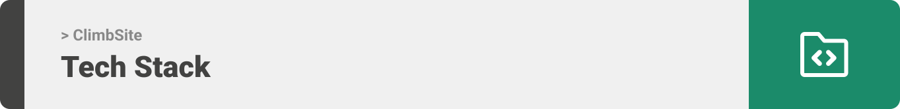
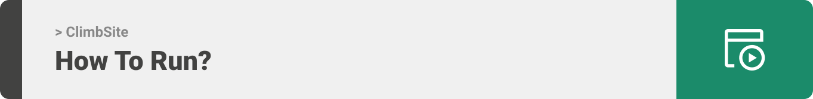

<div align="center">

> Hello world! This is the project’s summary that describes the project plain and simple, limited to the space available.

**[PROJECT PHILOSOPHY](https://github.com/joeri2k/ClimbSite#-project-philosophy) • [WIREFRAMES](https://github.com/joeri2k/ClimbSite#-wireframes) • [TECH STACK](https://github.com/joeri2k/ClimbSite#-tech-stack) • [IMPLEMENTATION](https://github.com/joeri2k/ClimbSite#-impplementation) • [HOW TO RUN?](https://github.com/joeri2k/ClimbSite#-how-to-run)**

</div>

<br><br>


> “ClimbSite” is a mobile application tailored just for climbers in Lebanon. It displays all climbing and bouldering spots across Lebanon. Not only that, but it goes even deeper to inform users about the many routes they could climb.
> Climbers can also use this app to chart their progress by calculating the number of attempts to reach the top, writing notes, sharing feedback, and even rating each try.
>
> Climbers don’t have to worry about the cost of climbing gear or the long distances required to get to their destinations. They can now plan events through “ClimbSite” and invite other adventurers to join them and even share the same equipment. Besides, this application is a great platform to connect a growing community of passionate climbers

### User Stories

- As a climber, I need a map to explore climbing crags or indoors gym.
- As a climber, I need to know the info of the crag I’ve picked.
- As a climber, I need to track my progress.
- As a climber I need to follow other climbers to check their progress.
- As a climber I need to create a to do list on what to climb next.

<br><br>


> This design was planned before on figma for the fine details, then moved to the actual design.
> Those images are screenshots from figma to show my vision before starting with the actual app.

| Login/Home                                                                        | Log Climb                                                                        |
| --------------------------------------------------------------------------------- | -------------------------------------------------------------------------------- |
|  |  |

| Explore                                                                        | Community/Climber's profile                                                                        |
| ------------------------------------------------------------------------------ | -------------------------------------------------------------------------------------------------- |
|  |  |

<br><br>



Here's a brief high-level overview of the tech stack the ClimbSite app uses:

- This project uses the [React Native framework](https://reactnative.dev/) for frontend development. React Native is an open-source UI software framework. It is used to develop applications for Android, Android TV, iOS, macOS, tvOS, Web, Windows and UWP by enabling developers to use the React framework along with native platform capabilities.
- For persistent storage (database), the app uses [MySQL](https://www.mysql.com/). MySQL is a relational database management system based on SQL – Structured Query Language.
- For the server side (backend), the app uses [Django framework](https://www.djangoproject.com/). Django is a high-level Python web framework, alongside [Django rest framework](https://www.django-rest-framework.org/) a powerful and flexible toolkit for building Web APIs

<br><br>


> Using the above mentioned tech stacks and the wireframes build with figma from the user sotries we have, the implementation of the app is shown as below, these are screenshots from the real app

| Home/Profile | Climblist/Settings |
| -------------------------------------------------------------------------------------------------------------- | -------------------------------------------------------------------------------------------------------------------- |
|  |  |

| Explore | Location info|
| --------------------------------------------------------------------------------------------------------- | --------------------------------------------------------------------------------------------------------------- |
|  |  |

| Event logging | Log Event/Explore events  |
| ------------------------------------------------------------------------------------------------------- | -------------------------------------------------------------------------------------------------------------------------- |
|  |  | 

| Rankings/Community  |
| ------------------------------------------------------------------------------------------------------- |
|  |

<br><br>


> This is an example of how you may give instructions on setting up your project locally.
> To get a local copy up and running follow these simple example steps.

### Prerequisites

This is an example of how to list things you need to use the software and how to install them.

- npm
  ```sh
  npm install npm@latest -g
  ```

### Installation

_Below is an example of how you can instruct your audience on installing and setting up your app. This template doesn't rely on any external dependencies or services._

1. Get a free API Key at [https://example.com](https://example.com)
2. Clone the repo
   ```sh
   git clone https://github.com/your_username_/Project-Name.git
   ```
3. Install NPM packages
   ```sh
   npm install
   ```
4. Enter your API in `config.js`
   ```js
   const API_KEY = "ENTER YOUR API";
   ```
